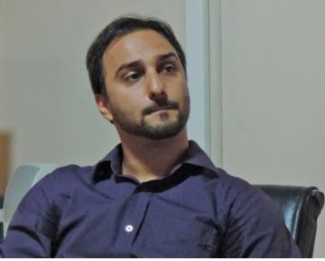

  
# Fernando Ioannides Lopes da Cruz

  <a href="https://www.linkedin.com/in/fernando-cruz-b0306364/"> 
    <i class="fa fa-linkedin" style='font-size:20px; margin: 0px 5px; color:#778899;'></i>
  </a>
  <a href="https://github.com/fernandoilcruz"> 
    <i class="fa fa-github" style='font-size:20px; margin: 0px 5px; color:#778899;'></i>
  </a>
  <a href="mailto:fernandoilcruz@gmail.com"> 
    <i class="fa fa-envelope" style='font-size:20px; margin: 0px 5px; color:#778899;'></i>
  </a>

  
<!-- Duas colunas -->

  
### Description
  
Economist, researcher and data analyst at Rio Grande do Sul State Secretariat for Planning, Budget and Management (SEPLAG-RS) and formerly at the Economics and Statistics Foundation (FEE). I have experience in quantitative methods and data analysis through R programming. My work, mainly, relates to measuring, forecasting and analyzing national and regional economic activity and business cycles. I have collaborated in multidisciplinary projects, such as leading and coincident indicators, public finance indicators and regional accounts. Additionally I was visiting professor at FISUL in 2018, where I lectured Investment Analysis. 

I hold a Ph.D. degree in Economics from the Federal University of Rio Grande do Sul (2018), a master degree from the same university (2013) and a bachelor degree from the Fluminense Federal University (2010).

***
  
### Interests
  
* Business Cycles
* Time Series Analysis
* Forecasting
* Finance

***

  

